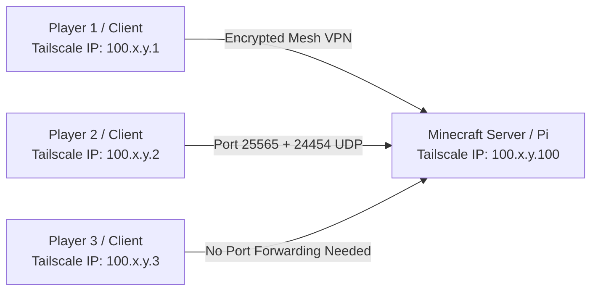

# 🎮 Fabric Extreme Survival Minecraft Server

[](https://www.minecraft.net/)
[](https://fabricmc.net/)
[](https://github.com/itzg/docker-minecraft-server)
[]()
[-C51A4A.svg?logo=raspberrypi)](https://www.raspberrypi.com/)
[](https://tailscale.com/)

A production-ready, heavily optimized **Fabric 26.1.2** Minecraft server designed for **extreme survival, rich exploration, immersive roleplay, proximity voice chat, and deep dungeon crawling**. 

Packaged cleanly in Docker and tuned with advanced JVM & tick optimizations to run smoothly on low-power hardware (such as a **Raspberry Pi 5 with 8GB RAM**) as well as standard cloud VPS or dedicated servers. Includes pre-configured **Server** and **Client** Modrinth modpacks (`.mrpack`).

---

## 📑 Table of Contents

- [✨ Key Features & Mod Highlights](#-key-features--mod-highlights)
  - [🌍 World Generation & Exploration](#-world-generation--exploration)
  - [⚔️ Hardcore Survival & RPG Mechanics](#️-hardcore-survival--rpg-mechanics)
  - [🎙️ Immersion, Audio & Social](#️-immersion-audio--social)
  - [🏡 Building, Farming & QoL](#-building-farming--qol)
  - [⚡ Server Performance & Optimizations](#-server-performance--optimizations)
- [📦 Modpack Bundles](#-modpack-bundles)
  - [Client Setup (For Players)](#client-setup-for-players)
- [🚀 Quick Start (Docker Compose)](#-quick-start-docker-compose)
  - [1. Prerequisites](#1-prerequisites)
  - [2. Clone & Configure](#2-clone--configure)
  - [3. Start the Server](#3-start-the-server)
  - [4. View Logs](#4-view-logs)
- [⚙️ Configuration Reference](#️-configuration-reference)
  - [Docker Environment Variables](#docker-environment-variables)
  - [ServerCore Performance Profiles](#servercore-performance-profiles)
- [🗺️ World Pre-generation (Chunky)](#️-world-pre-generation-chunky)
- [🌐 Zero-Port-Forwarding Multiplayer (Tailscale)](#-zero-port-forwarding-multiplayer-tailscale)
- [🍓 Raspberry Pi 5 & Low-Spec Server Best Practices](#-raspberry-pi-5--low-spec-server-best-practices)
- [💾 Backups & Server Migration](#-backups--server-migration)
- [📂 Project Structure](#-project-structure)
- [🤝 Contributing & License](#-contributing--license)

---

## ✨ Key Features & Mod Highlights

### 🌍 World Generation & Exploration
* **[Biomes O' Plenty](https://modrinth.com/mod/biomes-o-plenty) & [TerraBlender](https://modrinth.com/mod/terrablender)**: Dozens of vibrant new overworld biomes with lush flora, distinct climates, and custom trees.
* **[YUNG's Better Suite](https://modrinth.com/organization/yungnickyoung)**: Complete structural overhaul of dungeons, strongholds, mineshafts, Nether fortresses, desert/jungle temples, ocean monuments, witch huts, bridges, and cave biomes.
* **[Explorify](https://modrinth.com/mod/explorify)**, **[Dungeons & Taverns](https://modrinth.com/mod/dungeons-and-taverns)** & **[Much More Dungeons](https://modrinth.com/mod/much-more-dungeons)**: Hundreds of handcrafted ruins, towers, taverns, and dungeons filled with danger and secrets.
* **[End Remastered (EndRem)](https://modrinth.com/mod/endrem)**: Redesigns the journey to the End dimension — players must locate 12 unique custom Eyes of Ender hidden across rare structures and bosses rather than simply spamming craftable eyes.
* **[Eternal Nether](https://modrinth.com/mod/eternal-nether)**: Expanded hazards and content for the Nether realm.

### ⚔️ Hardcore Survival & RPG Mechanics
* **[Tough As Nails](https://modrinth.com/mod/tough-as-nails)**: Adds survival dynamics with thirst and body temperature (hyperthermia/hypothermia), requiring thermal armor, drinks, and shelter.
* **[Mob Champions](https://modrinth.com/mod/mob-champions)**: Rare elite monster variants spawn with tiered prefixes, special enchantments, higher health, and rewarding loot drops.
* **[Dangerous Fabric](https://modrinth.com/mod/dangerous-fabric)** & **[Illager Invasion](https://modrinth.com/mod/illager-invasion)**: More formidable enemy AI, difficult raid encounters, and deadly foes.
* **[The Darkness Will Find You](https://modrinth.com/mod/the-darkness-will-find-you)** & **[True Darkness](https://modrinth.com/mod/true-darkness)**: Unforgiving, pitch-black nights and unlit caves where darkness itself is lethal.
* **[Artifacts](https://modrinth.com/mod/artifacts)**: Powerful collectible baubles and relics located exclusively in dungeon loot chests.
* **[Immersive Armors](https://modrinth.com/mod/immersive-armors)** & **[Guns++](https://modrinth.com/mod/guns++)**: Thematic armors with unique passive set bonuses and modular ranged tactical defense.
* **[Critter Armory](https://modrinth.com/mod/critter-armory)**: Equippable armor and protection for pets and companions.

### 🎙️ Immersion, Audio & Social
* **[Simple Voice Chat](https://modrinth.com/plugin/simple-voice-chat)** + **[VC Interaction](https://modrinth.com/mod/vcinteraction)**: Full proximity positional voice chat running on UDP port `24454` with in-game voice interactions (e.g. scaring sculk sensors).
* **[Sound Physics Remastered](https://modrinth.com/mod/sound-physics-remastered)**: Realistic real-time sound attenuation, reverberation, and sound occlusion through walls and deep caves.
* **[Camerapture](https://modrinth.com/mod/camerapture)**: Functional photography and picture framing to capture memories with friends.
* **[Shogi](https://modrinth.com/mod/shogi)**: Fully playable in-game Japanese chess boards for leisurely downtime.
* **[SkinRestorer](https://modrinth.com/mod/skinrestorer)** & **[Show Me Your Skin](https://modrinth.com/mod/show-me-your-skin)**: Skin support for offline/hybrid mode servers and customizable armor visibility toggles.

### 🏡 Building, Farming & QoL
* **[Macaw's Suite](https://modrinth.com/organization/sketch-macaw)** (Bridges, Doors, Fences, Lights, Stairs, Trapdoors, Windows & BOP Addons): Vastly expanded architectural elements and variants for builders.
* **[Farmer's Delight](https://modrinth.com/mod/farmers-delight)** & **[Storage Delight](https://modrinth.com/mod/storage-delight)**: Complete cooking, meal preparation, crop farming, and rustic kitchen cabinetry.
* **[Crops Love Rain](https://modrinth.com/mod/crops-love-rain)** & **[Right Click Harvest](https://modrinth.com/mod/right-click-harvest)**: Faster crop growth during rainstorms and one-click harvesting/replanting.
* **[Lootr](https://modrinth.com/mod/lootr)**: Per-player instanced loot in dungeon chests so every adventurer receives their own rewards without griefing.
* **[Waystones](https://modrinth.com/mod/waystones)**: Craftable and world-generated teleportation pylons for traveling across large distances.
* **[Traveler's Backpack](https://modrinth.com/mod/travelers-backpack)** & **[Upgraded Iron Chests](https://modrinth.com/mod/iron-chests)**: High-capacity portable and stationary storage systems with fluid tanks and crafting grids.
* **[FallingTree](https://modrinth.com/mod/fallingtree)**: Instant tree chopping when cutting the base log.
* **[Call Your Pet Suite](https://modrinth.com/organization/samoleve)** (Dog, Cat, Horse, Nautilus, Happy Ghast): Whistle calling to manage and summon companions from afar.
* **[Gravestones](https://modrinth.com/mod/gravestones)**: Safeguards player inventory upon death in an interactable gravestone.
* **[Jade](https://modrinth.com/mod/jade)**, **[JEI (Just Enough Items)](https://modrinth.com/mod/jei)** & **[Just Enough Professions](https://modrinth.com/mod/just-enough-professions)**: Essential on-screen HUD inspection and recipe lookups.

---

### ⚡ Server Performance & Optimizations

This server uses an aggressive, multi-layered optimization stack designed to maintain a stable **20 TPS** even on memory- and CPU-constrained hardware:

| Mod / Component | Purpose |
| :--- | :--- |
| **[Lithium](https://modrinth.com/mod/lithium)** | Deep physics, chunk, entity, and world ticking optimizations. |
| **[ServerCore](https://modrinth.com/mod/servercore)** | Dynamic MSPT scaling, mobcaps, and entity activation ranges with villager lobotomization. |
| **[FerriteCore](https://modrinth.com/mod/ferritecore)** | Major RAM footprint reduction by deduplicating memory objects. |
| **[Krypton](https://modrinth.com/mod/krypton)** | Highly optimized network stack and packet pipeline for lower ping and latency. |
| **[Alternate Current](https://modrinth.com/mod/alternate-current)** | Replaces vanilla's laggy redstone engine with an efficient event-based system. |
| **[C2ME (Concurrent Chunk Management Engine)](https://modrinth.com/mod/c2me-fabric)** | Multi-threaded world generation and chunk I/O off the main server thread. |
| **[ModernFix](https://modrinth.com/mod/modernfix)** | Fixes vanilla memory leaks, deadlocks, and engine inefficiencies. |
| **[Entity Culling](https://modrinth.com/mod/entityculling)** | Skips ticking / rendering entities hidden behind solid blocks. |
| **[Chunky](https://modrinth.com/mod/chunky)** | Pre-generates terrain ahead of time to prevent chunk generation lag spikes during exploration. |
| **Aikar's JVM Flags & G1GC** | Custom garbage collector parameters tailored for low pause times (`MaxGCPauseMillis=200`). |

---

## 📦 Modpack Bundles

The repository includes pre-packaged Modrinth format modpacks located in the [`assets/`](assets/) directory:

- [`assets/server.mrpack`](assets/server.mrpack): Server-side modpack containing 119 mods (all gameplay logic, worldgen, survival mods, server performance utilities, and voice chat).
- [`assets/client.mrpack`](assets/client.mrpack): Client-side modpack containing 143 mods (adds client-side graphics engines like **Sodium**, **Iris Shaders**, **ImmediatelyFast**, shaderpacks, 3D textures, and **Fresh Animations**).

### Client Setup (For Players)

Players can install the client modpack in under 2 minutes:

#### Using Modrinth App (Recommended)
1. Download and install the [Modrinth App](https://modrinth.com/app).
2. Click **Create Profile** (the `+` icon) $\rightarrow$ select **Import from File**.
3. Select the [`assets/client.mrpack`](assets/client.mrpack) file from this repository.
4. Launch the profile and join the server!

#### Using Prism Launcher
1. In [Prism Launcher](https://prismlauncher.org/), click **Add Instance**.
2. Select **Import** on the left menu $\rightarrow$ browse to [`assets/client.mrpack`](assets/client.mrpack).
3. Click **OK** and launch.

> [!TIP]
> The client modpack already includes shaders (**Complementary Reimagined & Unbound**, **BSL**, **MakeUp-UltraFast**, **Solas**, **Photon**) and texture packs (**Fresh Animations**, **Faithful 32x**, **Default Dark Mode**). You can enable them under Video Settings $\rightarrow$ Shader Packs / Resource Packs.

---

## 🚀 Quick Start (Docker Compose)

### 1. Prerequisites
- [Docker](https://docs.docker.com/get-docker/) & [Docker Compose v2](https://docs.docker.com/compose/)
- At least 6 GB of RAM available on the host machine (recommended: 8 GB).

### 2. Clone & Configure
```bash
# Clone the repository
git clone https://github.com/your-username/minecraft-server.git
cd minecraft-server

# Copy sample environment configuration
cp .env.example .env
```

Review and customize values in [`docker-compose.yml`](docker-compose.yml) (e.g. `OPS`, `MOTD`, memory allocations, or timezone).

### 3. Start the Server
```bash
docker compose up -d
```

Docker will pull the `itzg/minecraft-server` image, mount [`assets/server.mrpack`](assets/server.mrpack), apply the configuration, install Fabric, and boot the server.

### 4. View Logs
```bash
docker compose logs -f mc
```

Once you see `[Server thread/INFO]: Done (...s)! For help, type "help"`, the server is online and ready for players.

---

## ⚙️ Configuration Reference

### Docker Environment Variables

The primary server settings are defined in [`docker-compose.yml`](docker-compose.yml):

```yaml
environment:
  EULA: "TRUE"
  VERSION: "26.1.2"
  TYPE: "FABRIC"
  MOD_PLATFORM: "MODRINTH"
  MODRINTH_MODPACK: "/data/server.mrpack"
  INIT_MEMORY: "4G"
  MAX_MEMORY: "6G"
  USE_AIKAR_FLAGS: "TRUE"
  VIEW_DISTANCE: "6"
  SIMULATION_DISTANCE: "4"
  ENTITY_BROADCAST_RANGE_PERCENTAGE: "60"
  MAX_TICK_TIME: "60000"
  MODE: "survival"
  DIFFICULTY: "hard"
  ICON: "/data/assets/images/server-icon.png"
  OVERRIDE_ICON: "TRUE"
  MODPACK_VERSION: "1.0.1" # Incrementing this triggers container modpack reload
  OPS: |
    fermeridamagni
```

### ServerCore Performance Profiles

The server includes a battle-tested [`config/servercore_config.yml`](config/servercore_config.yml) with:
- **Dynamic MSPT Target**: Aims for $\le 35$ ms tick duration. If tick times spike, it automatically and dynamically scales chunk tick distance, simulation distance, and mob caps until the server stabilizes.
- **Villager Lobotomization**: Stagnant 1x1 trading-hall villagers tick once every 20 ticks instead of every tick, saving massive CPU cycles.
- **Breeding Caps**: Prevents runaway animal / villager farm lag with soft caps per radius.
- **Custom Activation Ranges**: Mobs further from players enter inactive sleep states.

---

## 🗺️ World Pre-generation (Chunky)

Terrain generation with mods like *Biomes O' Plenty* and *YUNG's Suite* is CPU-intensive. To ensure zero exploration lag during gameplay, **pre-generate the world** once before opening the server to players.

Attach to the server console or send RCON/docker commands:

```bash
# 1. Attach to server console
docker compose exec mc rcon-cli

# 2. Set world border radius (e.g. 5,000 blocks radius from spawn)
worldborder set 10000

# 3. Configure chunky radius
chunky shape circle
chunky radius 5000

# 4. Start pre-generation
chunky start
```

You can monitor progress with `chunky progress` or pause/continue anytime with `chunky pause` / `chunky continue`.

---

## 🌐 Zero-Port-Forwarding Multiplayer (Tailscale)

This server is designed to work out of the box with **[Tailscale](https://tailscale.com/)**, allowing you and your friends to play together over an encrypted mesh VPN without opening ports to the public internet or dealing with CGNAT / Dynamic DNS.



### How to Connect via Tailscale:
1. Install Tailscale on the host machine running the server (`curl -fsSL https://tailscale.com/install.sh | sh && sudo tailscale up`).
2. Have your friends install Tailscale on their PCs and join your Tailnet (or use Tailscale's **Node Sharing** feature).
3. Players connect directly using the server host's Tailscale IP (e.g., `100.x.y.z:25565`).
4. Positional voice chat automatically works over UDP `100.x.y.z:24454`.

---

## 🍓 Raspberry Pi 5 & Low-Spec Server Best Practices

Running a heavily modded Minecraft server on a single-board computer like the **Raspberry Pi 5 (8GB)** requires mindful setup:

1. **Boot from NVMe / Fast USB 3.0 SSD**: MicroSD cards suffer from high I/O latency and will wear out quickly under world writes. Use an NVMe HAT or USB 3 SSD.
2. **Configure Active Cooling**: Ensure your Raspberry Pi has the official Active Cooler or a heatsink fan to prevent thermal throttling under heavy mod ticking.
3. **ZRAM / Swap Space**: Enable 4–8 GB of swap or zram on DietPi / Linux to avoid Out-Of-Memory (OOM) killer terminations.
4. **Tune View Distance**: Default `VIEW_DISTANCE: 6` and `SIMULATION_DISTANCE: 4` are optimized for 4–8 concurrent players on the Pi 5.

---

## 💾 Backups & Server Migration

The Minecraft world and runtime state are stored in the Docker volume `minecraft_data`.

### Create an Instant Backup:
```bash
# Create a timestamped tar archive of the entire server data volume
docker run --rm \
  -v minecraft-server_minecraft_data:/data \
  -v $(pwd):/backup \
  busybox tar cvf /backup/backup_$(date +%Y%m%d_%H%M%S).tar /data
```

### Regenerate or Wipe World (Fresh Start):
```bash
# Stop container and delete the volume
docker compose down -v

# Boot a fresh server instance
docker compose up -d
```

---

## 📂 Project Structure

```
├── .agents/                    # Custom agent workflows and skills
│   └── skills/migrate-server/  # Automated backup & server migration skill
├── assets/
│   ├── client.mrpack           # Modrinth Client Modpack (143 mods + shaders + textures)
│   ├── server.mrpack           # Modrinth Server Modpack (119 mods)
│   └── images/
│       └── server-icon.png     # Official server icon (64x64)
├── config/
│   └── servercore_config.yml   # Optimized ServerCore dynamic tick configuration
├── .env.example                # Sample environment variables
├── docker-compose.yml          # Docker Compose service definition
├── AGENTS.md                   # AI agent instructions & specifications
└── README.md                   # Project documentation
```

---

## 🤝 Contributing & License

Contributions, mod suggestions, and performance tuning improvements are welcome!

1. Fork the repository.
2. Create your feature branch (`git checkout -b feature/awesome-mod`).
3. Commit your changes (`git commit -m 'Add support for custom performance tweak'`).
4. Push to the branch (`git push origin feature/awesome-mod`).
5. Open a Pull Request.

Distributed under the **MIT License**. See `LICENSE` for more information.

---

<div align="center">
Crafted with ❤️ for high-performance survival adventures.
</div>
